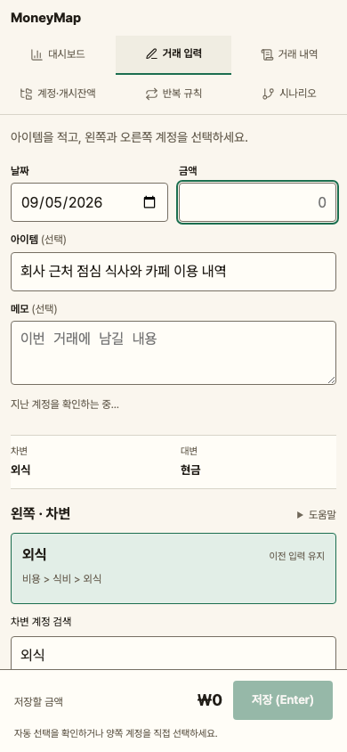
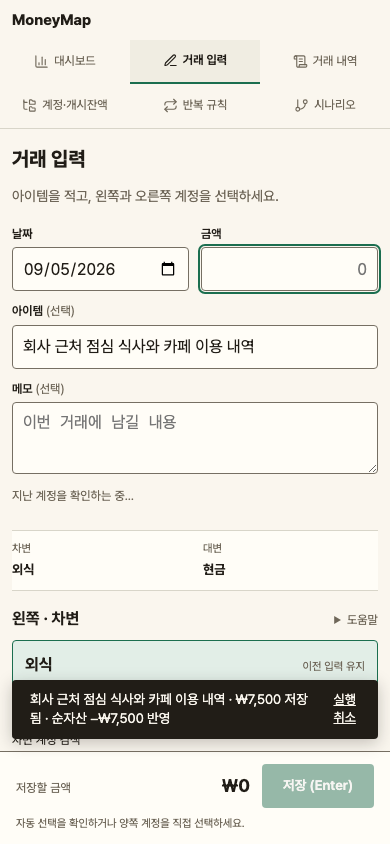

# 거래 입력 QA — 2026-09-05

거래 입력을 브라우저에서 검증해 중간 심각도 문제 1건을 발견하고 수정했다. 수정 후 저장 알림과 실행취소가 모바일 저장 버튼 위에 표시되고 실제 클릭되는 것을 확인했다. 발견한 미해결 문제는 없다.

| 항목 | 결과 |
|---|---|
| 브랜치 | `mildsalmon/transaction-input` |
| 구현 커밋 | `9b7d5ca` |
| 수정 / 회귀 테스트 커밋 | `c1e245a` / `b27a933` |
| 대상 | `http://127.0.0.1:5277` — React/Vite + FastAPI |
| 범위 | Standard, 변경 중심 QA: 거래 입력·내역 및 인접 화면 |
| 탐색 | 대시보드, 거래 입력, 거래 내역, 계정·개시잔액, 반복 규칙, 시나리오, 보관된 시나리오 — 7개 URL |
| 실행 환경 | gstack browse Chromium, 별도 임시 SQLite DB, QA 전용 포트 5277/8877 |
| 소요 / 캡처 | 약 20분 / 15장 |
| 결과 | 발견 1건, 검증된 수정 1건, best-effort 0건, 되돌림 0건, 미해결 0건 |

## 확인한 사용자 흐름

- 계정이 없는 입력 화면의 저장 차단과 안내, 표준 계정 생성, 현금 개시잔액 입력.
- 차변·대변 항목 클릭, 경로 검색, 검색 결과 없음과 검색어 지우기, 그룹 접기·펼치기. 화살표 키로 외식에서 식료품으로 포커스와 선택이 함께 이동함을 확인했다.
- 아이템·금액·여러 줄 메모 저장, 내역의 메모 보기에서 정확한 텍스트 확인. 성공 후 금액·메모만 비워지는 동작.
- 동일 아이템의 마지막 차변·대변 자동 선택, 먼저 입력한 금액 유지, 이전 메모 미복원. 수동으로 대변을 바꿔 저장한 뒤 최신 조합을 확인하고 실행취소 후 이전 조합으로 돌아옴을 확인했다.
- 기본 입력에서 분할 입력으로 초안 유지, 계정 없이 금액만 입력한 행의 저장 차단, 3개 행이 있는 상태의 기본 전환 차단, 계정 선택 후 균형이 맞는 분할 저장.
- 실제 반복 규칙을 생성·실행한 거래가 마지막 조합 조회에 포함되지 않음. 최신 거래가 분할이면 오래된 단순 조합으로 대체하지 않음.
- 부채 선택만으로 금액을 바꾸지 않고 명시적 잔액 채우기 버튼으로 10,000원을 채움. 저장·실행취소 확인.
- 모바일 390×844의 저장·실행취소 및 390×460의 일반 흐름 배치. 회귀 테스트로 320/390/720px 너비에서 긴 아이템과 기본·분할 저장 알림을 확인했다.
- 대시보드 잔액과 차트 표, 계정 화면, 반복 규칙, 시나리오·보관 목록의 탐색. 전체 기존 E2E로 인접 기능의 회귀를 확인했다.

## ISSUE-001 — 모바일 저장 버튼이 저장 알림과 실행취소를 가림

| 항목 | 내용 |
|---|---|
| 심각도 / 분류 | Medium / Functional |
| URL | `/transactions/new` |
| Fix Status | **verified** |
| 수정 커밋 | `c1e245a` |
| 변경 파일 | `frontend/src/views/TxnInput.tsx`, `frontend/src/views/transaction-input.css` |

재현 절차:

1. 화면을 390×844로 설정한다.
2. 아이템 `회사 근처 점심 식사와 카페 이용 내역`, 금액과 유효한 차변·대변을 입력한다.
3. 저장을 누른다. 저장은 성공하지만 알림과 실행취소가 하단 고정 저장 영역 뒤에 가려진다. 기본·분할 입력에서 관찰했고, 기본 저장을 반복해 재현했다.

수정 전 알림은 y=772.875–832, 저장 영역은 y=751.063–844였다. 알림 중앙의 `elementFromPoint`는 저장 영역을 반환했다. 알림이 만료될 때까지 실행취소를 볼 수 없었다.

기존 ResizeObserver로 측정한 저장 영역 높이를 공통 상위 `.shell`에 전달하고, 모바일 알림을 그 높이보다 12px 위에 배치했다. 화면 높이가 480px 이하일 때는 기존 일반 흐름을 유지하며, 거래 입력 화면을 나가면 공유 높이 값을 제거한다.

수정 후 동일 조건에서 알림은 y=679.875–739, 저장 영역은 y=751.063부터 시작했다. 실행취소 중앙에서 실제 버튼이 히트되고 클릭 후 거래가 삭제됨을 확인했다. 390×460에서도 저장 영역은 `position: static`이며 실행취소가 동작했다.

**수정 전**

**수정 후**

## 자동 검증

| 검증 | 결과 |
|---|---|
| `cd backend && uv run pytest -q` | **305 passed**, 9.94초 |
| `cd frontend && MONEYMAP_E2E_BACKEND_PORT=8876 MONEYMAP_E2E_FRONTEND_PORT=5276 npm run e2e` | **62 passed**, 약 1분 |
| `cd frontend && npm run build` | TypeScript 검사 및 Vite 프로덕션 빌드 성공 |
| `git diff --check` | 통과 |
| 신규 회귀 파일 단독 실행 | **2 passed**, 기본·분할 입력 |

신규 `frontend/e2e/transaction-input-toast.regression-1.spec.ts`는 API를 모킹하고 알림과 저장 영역의 위치, 실행취소의 실제 클릭 가능 여부와 DELETE 요청, 짧은 화면의 일반 흐름, 화면 이탈 시 높이 정리를 검증한다. 테스트 커밋은 `b27a933`이다. 기존 테스트와 CI 설정은 변경하지 않았다.

회귀 테스트 첫 실행은 테스트의 `**/api/**` 모킹이 Vite의 `/src/api/` 모듈까지 가로채면서 실패했다. `/api/`로 시작하는 실제 API 경로만 모킹하도록 수정한 뒤 단독 실행과 전체 실행 모두 통과했다. 제품 결함으로 집계하지 않았다.

## 점수와 한계

| 범주 | 수정 전 | 수정 후 |
|---|---:|---:|
| Console / Links / Visual / UX / Content / Accessibility | 각각 100 | 각각 100 |
| Functional | 92 | 100 |
| Performance | 100 | 100 |
| 가중 QA 점수 | **98.4** | **100** |

이 점수는 이번에 탐색한 범위의 발견 사항에 따른 점수이며 전체 제품의 무결함이나 접근성 인증을 뜻하지 않는다. 브라우저 콘솔 오류는 발견하지 않았다. 로컬 개발 서버의 반복 규칙 화면 한 번의 로드에서 TTFB 4ms, DOMReady 38ms, load 40ms를 관찰했으며 운영 성능 측정으로 해석하지 않는다.

백엔드에는 기존 Starlette/httpx 사용 중단 예고 경고 1개가 있다. 테스트와 브라우저 조작은 개인 원장과 분리된 임시 DB에서 수행했다. 실제 iOS/Android 키보드, 기기 safe-area, 브라우저 자체 200% 확대는 직접 검증하지 않았다. 낮은 viewport와 반응형 자동 검증이 이 실기기 검증을 대체하지는 않는다.

새로 미룬 버그가 없어 TODOS.md 변경은 없다. 푸시·PR·배포는 수행하지 않았다.

**PR Summary:** QA found 1 issue, fixed 1, health score 98.4 → 100.
